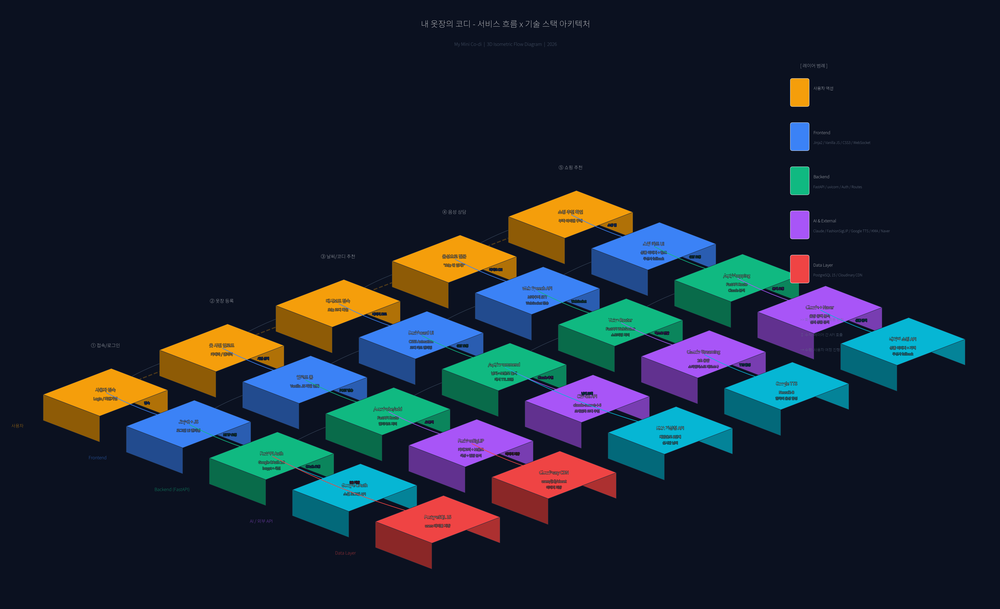
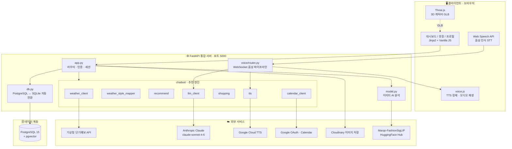
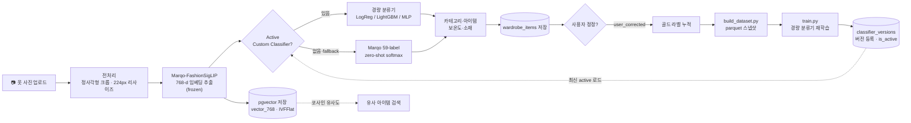
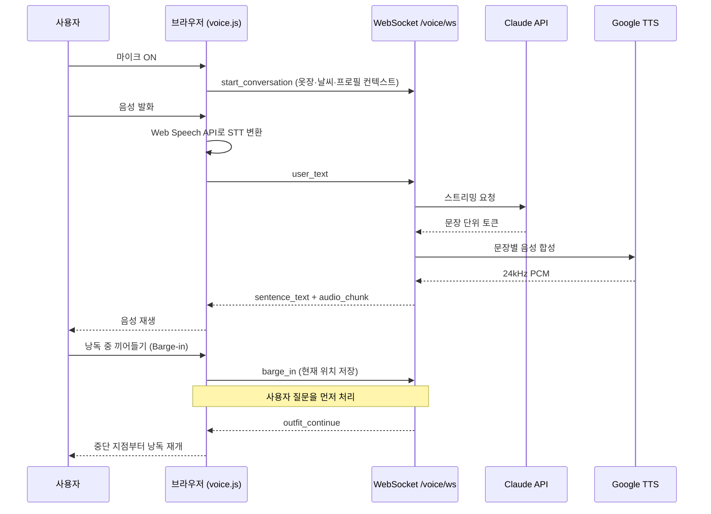
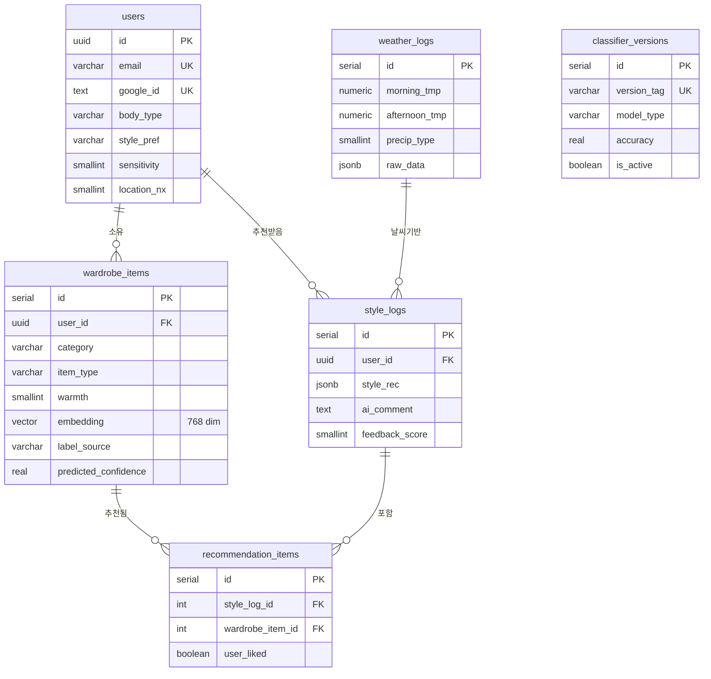

<div align="center">

# 👗 내 옷장의 코디 · My Mini Codi

### AI 기반 개인 스타일리스트 웹 서비스

내 옷장 사진을 등록하면, 오늘의 **날씨 · 일정 · 체형**에 딱 맞는 코디를<br/>
30년 경력의 **AI 수석 디자이너**가 직접 **음성**으로 알려줍니다.

<br/>


<br/>

[](http://localhost:5000/dashboard)

<sub>⚠️ 본인 컴퓨터에서 서버를 먼저 실행한 뒤 클릭 → **각자의 로컬 대시보드**가 열립니다 · [실행 방법 보기](#-시작하기)</sub>

(프로젝트 폴더에서 실행 → `cd CW && docker-compose up` &nbsp;또는&nbsp; `cd CW && uvicorn app:app --host 0.0.0.0 --port 5000`)

</div>

---

## 📋 프로젝트 한눈에 보기

| 항목 | 내용 |
|---|---|
| **프로젝트명** | 내 옷장의 코디 (My Mini Codi) |
| **한 줄 소개** | 옷장 사진 → AI 자동 분류 → 날씨·일정 기반 코디 추천 → 음성 스타일링 어시스턴트 |
| **핵심 차별점** | ① 실제 보유 옷을 직접 언급하는 개인화 추천 · ② 끼어들기 가능한 실시간 음성 대화 · ③ 사용자 정정 데이터로 분류기를 재학습하는 성장 루프 |
| **개발 형태** | 4인 팀 풀스택 협업 (기능별 `feat/*` 브랜치 전략) |
| **아키텍처** | FastAPI 단일 서버 + PostgreSQL(pgvector) + 외부 AI API 오케스트레이션 |
| **배포** | Docker Compose (web + DB), CPU 전용 경량 이미지 |
| **현재 버전** | v1.0 (2026-04) |

---

## 목차

- [서비스 소개](#-서비스-소개)
- [데모 & 스크린샷](#-데모--스크린샷)
- [핵심 기능](#-핵심-기능)
- [시스템 아키텍처](#-시스템-아키텍처)
- [AI/ML 파이프라인](#-aiml-파이프라인)
- [실시간 음성 파이프라인](#-실시간-음성-파이프라인)
- [기술 스택](#-기술-스택)
- [데이터베이스 설계](#-데이터베이스-설계)
- [API 레퍼런스](#-api-레퍼런스)
- [프로젝트 구조](#-프로젝트-구조)
- [시작하기](#-시작하기)
- [엔지니어링 하이라이트](#-엔지니어링-하이라이트)
- [개발 로드맵](#-개발-로드맵)
- [팀 & 협업](#-팀--협업)

---

## 🎯 서비스 소개

> **"오늘 뭐 입지?"** — 매일 아침 반복되는 이 고민을 AI가 대신 풀어줍니다.

`내 옷장의 코디`는 패션에 관심은 있지만 매일 아침 옷 고르기가 막막한 사용자를 위한 **AI 스타일링 어시스턴트**입니다. 단순한 룩북 추천을 넘어, **사용자가 실제로 보유한 옷**을 인식하고 그 안에서 오늘 날씨와 일정에 가장 적합한 조합을 제안합니다.

```
옷장 사진 업로드  →  AI 자동 분류·등록  →  날씨/일정 분석  →  내 옷 기반 코디 추천  →  음성 스타일링 대화
```

핵심 사용자 경험은 다음과 같습니다.

- **AI 자동 옷장 관리** — 옷 사진을 올리면 종류·보온도·소재를 자동 분석해 디지털 옷장에 등록
- **날씨 맞춤 추천** — 기상청 단기예보로 아침·낮·저녁 체감온도를 읽고, 내 옷장 안에서 최적 조합 매칭
- **음성 수석 디자이너** — 30년 경력 콘셉트의 AI가 내 옷 이름을 직접 부르며 음성으로 코디를 코칭
- **일정 기반 TPO** — 구글 캘린더 일정을 읽어 발표·운동·데이트 등 상황(TPO)에 맞춰 코디 자동 조정
- **부족분 쇼핑 연결** — 옷장에 없는 아이템은 무신사 검색 링크로 즉시 연결

---

## 🖥️ 데모 & 스크린샷

> 📸 아래 자리표시자를 실제 캡처로 교체하세요. `docs/screenshots/` 폴더를 만들고 이미지를 넣은 뒤 경로만 바꾸면 됩니다.

<div align="center">

| 메인 대시보드 | AI 수석 디자이너 패널 |
|:---:|:---:|
|  |  |
| 날씨·오늘의 코디·3D 캐릭터 | 음성 대화 + 옷장 아이템 직접 언급 |

| 옷장 관리 | 음성 인터랙션 (티키타카) |
|:---:|:---:|
|  |  |
| AI 자동 분류 결과 + 사용자 정정 | 마이크 ON → 끼어들기 → 이어읽기 |

</div>

<details>
<summary>📐 전체 서비스 흐름도 (이미지)</summary>

<br/>

<div align="center">

</div>

> `python make_flowchart.py` 로 재생성할 수 있으며, 결과물은 `flowchart/` 폴더에 저장됩니다.

</details>

---

## ✨ 핵심 기능

### 1. AI 옷장 관리
- 옷 사진 업로드 → **Marqo-FashionSigLIP**(패션 특화 CLIP) 기반 자동 분류
- **6개 카테고리** (상의 · 하의 · 아우터 · 원피스 · 신발 · 악세서리), 총 **59개 세부 라벨** 인식
- 아이템 종류 · 보온도(0~5) · 소재 자동 추론
- Cloudinary에 **사용자별 폴더**로 이미지 격리 저장, 옷 삭제 시 고아 폴더 자동 정리
- 분류가 틀리면 사용자가 직접 정정 → 정정 데이터는 재학습용 **골드 라벨**로 누적

### 2. 날씨 기반 코디 추천
- 기상청 **단기예보 API**(격자 좌표 기반)로 아침·낮·저녁 체감온도 수집
- 온도 · 강수 · 습도 · **일교차**를 종합하는 스타일 매핑 엔진
- 보온도 필터링으로 내 옷장 아이템과 날씨 조건 매칭
- 레이어링 필요 여부 자동 판단 + 시간대별 착·탈의 팁 제공
- **2단계 응답 UX**: `quick=true`(날씨/스타일 즉시, ~1s) → 이후 AI 코멘트(~4s) 비동기 로드

### 3. AI 수석 디자이너 코멘트
- **Claude API (`claude-sonnet-4-6`)** 기반 개인화 스타일링 코멘트 생성
- 실제 옷장 아이템 이름을 **직접 언급**하는 맞춤 제안 (예: *"네 청자켓 꺼내, 크롭탑이랑 딱이야"*)
- 없는 아이템은 솔직하게 알리고 무신사 검색 링크로 연결
- 상의 · 하의 · 아우터 핵심 포인트를 말풍선(bubble) 형태로 요약

### 4. AI 수석 디자이너 음성 인터랙션 (티키타카)
- 마이크 ON → **Web Speech API**로 브라우저 내 음성 인식(STT)
- **WebSocket**(`/voice/ws`)으로 Claude 응답을 문장 단위 스트리밍
- **Google Cloud TTS**로 자연스러운 한국어 음성 출력 (24kHz PCM)
- **Barge-in**: 코멘트 낭독 중 말을 끊으면 → 위치 저장 → 대화 → 중단 지점부터 자동 재개
- **TTS 정제 엔진**: 알파벳·이모지·기호를 한국어로 치환/묵음 처리 (서버·브라우저 이중 동기화)

### 5. 구글 캘린더 연동
- Google **OAuth 2.0** 로그인 후 오늘 일정 자동 조회
- 일정 키워드 분석 → **TPO 자동 감지** (예: "발표" → 포멀, "운동" → 스포티)
- 감지된 TPO를 코디 추천과 AI 코멘트에 반영

### 6. 쇼핑 연동
- 날씨/스타일 조건 대비 부족한 아이템 발생 시 **무신사 검색 링크** 자동 생성
- 카테고리별 쇼핑 카드 UI (이모지 + 색상 구분)
- 대화창 내 링크도 클릭 가능한 카드로 자동 변환

### 7. 사용자 프로필 & 개인화
- 키 · 몸무게 · 체형 · 성별 · 선호 스타일 · 온도 민감도 · TPO · 위치 설정
- Google OAuth 또는 이메일/비밀번호 로그인
- 프로필 기반으로 AI 코멘트를 개인화 (체형·스타일 선호 반영)

---

## 🏗️ 시스템 아키텍처

브라우저(클라이언트) → **FastAPI 단일 서버** → 외부 AI 서비스 / PostgreSQL 로 이어지는 오케스트레이션 구조입니다. 음성·이미지·텍스트 요청을 한 서버에서 통합 처리합니다.



---

## 🤖 AI/ML 파이프라인

이 프로젝트의 핵심 엔지니어링 자산입니다. 대형 패션 모델을 **고정 feature extractor**로 두고, 그 위에 가볍고 교체 가능한 분류기를 얹는 **하이브리드 구조**를 채택했습니다. 사용자가 정정한 라벨이 쌓이면 분류기를 재학습해 정확도를 끌어올리는 **성장 루프(growth loop)**가 핵심입니다.



**설계 의도 (왜 이 구조인가)**

| 결정 | 이유 |
|---|---|
| FashionSigLIP을 **고정** feature extractor로 사용 | 600MB 대형 모델 가중치는 건드리지 않아 안정성 유지, 임베딩 품질 확보 |
| 임베딩 위에 **경량 분류기** 학습 | 데이터가 수십~수천 개여도 CPU에서 10~60초면 학습 완료, `joblib` 파일 하나만 교체하면 배포 |
| **pgvector**에 768-d 임베딩 저장 | 재학습 없이도 코사인 유사도로 즉시 retrieval 기반 유사 아이템 추천 |
| **사용자 정정**을 별도 라벨로 분리 (`label_source`) | 모델 예측(auto)과 사용자 정정(user_corrected)·확인(verified)을 구분해 학습 신뢰도 관리 |
| **모델 버전 테이블** (`classifier_versions`) | 추론 시 최신 active 버전 로드, A/B 테스트 시 특정 버전 고정 가능 |

> 관련 코드: `model.py` (추론·임베딩), `training/` (`build_dataset.py` · `train.py` · `classifier.py` · `evaluate.py`), `retrain_classifier.py` (재학습 오케스트레이션)

---

## 🎙️ 실시간 음성 파이프라인

음성 어시스턴트는 **STT(브라우저) → LLM(Claude 스트리밍) → TTS(Google)** 3단계를 WebSocket으로 묶어, 사람과 대화하듯 **끊고 이어가는** 경험을 구현했습니다.



**핵심 설계 포인트**

- **문장 단위 스트리밍** — Claude의 출력을 문장으로 쪼개 TTS에 흘려보내 첫 음성까지의 지연을 최소화
- **Barge-in & Resume** — 낭독 중 사용자가 말하면 즉시 멈추고 위치를 기억했다가, 답변 후 이어읽기
- **순수 한국어 TTS** — 알파벳·이모지·기호가 음성으로 새어 나가지 않도록 `tts.py`(서버)·`voice.js`(브라우저) 양쪽에서 동일한 정제 테이블로 치환
- Gemini Live API를 걷어내고 **Claude 단일 엔진**으로 통합해 텍스트 챗봇과 음성 응답의 톤을 일치 (자세한 의사결정: `voice/REDESIGN.md`)

---

## 🛠️ 기술 스택

| 영역 | 기술 | 선택 이유 |
|---|---|---|
| **웹 프레임워크** | FastAPI + Uvicorn | async 네이티브 + WebSocket 1급 지원 (Flask에서 마이그레이션) |
| **템플릿** | Jinja2 | 서버 사이드 렌더링, 가벼운 SPA 대체 |
| **데이터베이스** | PostgreSQL 15 + pgvector / SQLite | 운영은 Postgres(벡터 검색), 로컬은 SQLite 자동 전환 |
| **인증** | Flask-Login + Authlib (Google OAuth 2.0) | 소셜 로그인 + 세션 관리 |
| **이미지 저장** | Cloudinary | 사용자별 폴더 격리 + CDN 제공 |
| **이미지 AI** | Marqo-FashionSigLIP (OpenCLIP) · YOLO (Ultralytics) | 패션 특화 임베딩 · 객체 탐지 (rembg 배경 제거는 코드에 준비됐으나 현재 미적용) |
| **재학습** | scikit-learn · LightGBM · joblib · pyarrow | 경량 분류기 학습/직렬화 + parquet 스냅샷 |
| **AI 스타일링** | Anthropic Claude (`claude-sonnet-4-6`) | 개인화 코멘트 · 음성 대화 공용 엔진 |
| **날씨** | 기상청 단기예보 API (KMA) | 격자 좌표 기반 국내 정밀 예보 |
| **음성 STT** | Web Speech API | 브라우저 내장 · 무료 · 한국어 지원 |
| **음성 TTS** | Google Cloud Text-to-Speech | 자연스러운 한국어 합성 |
| **실시간 통신** | WebSocket (FastAPI · Starlette) | 음성 스트리밍 양방향 채널 |
| **3D 캐릭터** | Three.js (GLB 모델) | 대시보드 캐릭터 렌더링 |
| **컨테이너** | Docker + docker-compose | web + DB 원클릭 기동, CPU 전용 경량 빌드 |

---

## 🗄️ 데이터베이스 설계

운영 환경은 PostgreSQL 15 + pgvector를 사용합니다. 사용자·옷장·날씨·추천을 중심으로, **재학습 파이프라인을 위한 모델 버전/학습 이력 테이블**까지 설계되어 있습니다.



**주요 테이블**

| 테이블 | 역할 |
|---|---|
| `users` | 계정(이메일/OAuth) + 프로필 + 위치(격자 좌표) |
| `wardrobe_items` | 옷장 아이템 + 768-d 임베딩 + 예측/정정 라벨(`label_source`) |
| `weather_logs` | 날씨 데이터 누적 (기상청 원본 JSONB 포함) |
| `style_logs` | AI 코디 추천 이력 + 사용자 피드백 점수 |
| `recommendation_items` | `style_logs` ↔ `wardrobe_items` 연결 + 아이템 단위 좋아요/착용 |
| `classifier_versions` | 재학습 모델 버전·정확도·active 플래그 |
| `training_runs` | 학습 데이터셋 스냅샷 (감사/재현용) |
| `top_outfits_by_weather` (VIEW) | 피드백 점수 기반 날씨별 인기 코디 집계 |

> 스키마 전문: [`docker/init.sql`](docker/init.sql) — 확장(`uuid-ossp`, `pg_trgm`, `vector`), 인덱스(IVFFlat 코사인), `updated_at` 트리거 포함

---

## 🔌 API 레퍼런스

FastAPI 단일 서버가 페이지 라우트와 JSON/WebSocket API를 함께 제공합니다.

**인증 · 페이지**

| 메서드 | 경로 | 설명 |
|---|---|---|
| `GET` | `/` · `/dashboard` | 메인 대시보드 |
| `GET/POST` | `/login` | 로그인 페이지·처리 (회원가입 탭 포함) |
| `POST` | `/signup` | 이메일 회원가입 처리 |
| `GET` | `/logout` | 로그아웃 |
| `GET` | `/auth/google` · `/auth/google/callback` | Google OAuth 2.0 (PostgreSQL 환경 전용) |
| `GET/POST` | `/profile` | 프로필 조회·저장 |
| `GET` | `/fashion-show` | 3D 패션쇼 페이지 |

**옷장 · 추천**

| 메서드 | 경로 | 설명 |
|---|---|---|
| `GET` | `/wardrobe` · `/api/wardrobe` | 옷장 목록 (페이지·JSON) |
| `POST` | `/wardrobe/add` | 옷 업로드 → AI 분석·등록 |
| `POST` | `/wardrobe/move/{id}` · `/wardrobe/correct/{id}` | 카테고리 변경 · 라벨 정정 |
| `POST` | `/wardrobe/delete/{id}` | 옷 삭제 (+ Cloudinary 정리) |
| `GET` | `/api/wardrobe/similar/{id}` | pgvector 기반 유사 아이템 검색 |
| `GET` | `/api/recommend` | 코디 추천 (`?quick=true` 시 코멘트 생략) |
| `GET` | `/api/weather` · `/api/calendar` | 날씨 · 캘린더 일정 JSON |
| `GET` | `/api/shopping` | 무신사 쇼핑 카드 |

**피드백 · 음성**

| 메서드 | 경로 | 설명 |
|---|---|---|
| `POST` | `/feedback/style/{log_id}` · `/feedback/item/{rec_item_id}` | 코디·아이템 피드백 |
| `GET` | `/api/style-report` | 피드백 기반 스타일 리포트 |
| `POST` | `/chat` · `/api/tts` | 텍스트 챗봇 · TTS 합성 |
| `WS` | `/voice/ws` | 실시간 음성 파이프라인 |
| `GET` | `/proxy/image` | Cloudinary 이미지 same-origin 프록시 (canvas 색상 추출용) |
| `GET` | `/voice` | 레거시 음성 채팅 페이지 (현재 대시보드에 통합) |

---

## 📁 프로젝트 구조

> **폴더 규칙**: 메인 실행 `.py`는 루트에, 기능별 산출물은 전용 폴더에 격리합니다. (`CLAUDE.md` 참조)

```
CW/
├── app.py                    # FastAPI 메인 서버 (라우터·인증·세션 통합)
├── db.py                     # DB 연결 (PostgreSQL ↔ SQLite 자동 전환)
├── model.py                  # 이미지 AI 분석 (FashionSigLIP + 분류기 + 임베딩)
├── retrain_classifier.py     # 누적 재학습 오케스트레이션
├── make_flowchart.py         # 흐름도 생성 스크립트
├── make_eval.py              # 이미지 분류 정확도 평가 스크립트
├── make_cloudinary_cleanup.py # Cloudinary ↔ DB 정합성 점검·정리 유틸
│
├── chatbot/                  # 추천·날씨·LLM·TTS 모듈
│   ├── weather_client.py     #   기상청 API 클라이언트
│   ├── weather_style_mapper.py  # 날씨 → 스타일 매핑 엔진
│   ├── recommend.py          #   옷장 매칭 로직
│   ├── llm_client.py         #   Claude API (코멘트 + 챗봇 스트리밍)
│   ├── shopping.py           #   무신사 검색 쿼리 생성
│   ├── tts.py                #   Google TTS + 정제 함수 (clean_for_tts)
│   └── calendar_client.py    #   Google Calendar → TPO 감지
│
├── voice/                    # 실시간 음성 파이프라인
│   ├── router.py             #   WebSocket /voice/ws 엔드포인트
│   ├── pipeline.py           #   하위호환 stub → chatbot/tts.py 재노출
│   └── REDESIGN.md           #   음성 기능 재설계 의사결정 기록
│
├── training/                 # 경량 분류기 재학습 파이프라인
│   ├── build_dataset.py      #   임베딩 → parquet 스냅샷
│   ├── train.py              #   LogReg / LightGBM / MLP 학습
│   ├── classifier.py         #   추론용 분류기 래퍼 (active 버전 로드)
│   └── evaluate.py           #   정확도·top-3 평가
│
├── templates/                # Jinja2 HTML (dashboard·wardrobe·profile·login)
├── static/                   # css · js(main.js·voice.js) · images · models(GLB)
├── docker/init.sql           # PostgreSQL 초기 스키마 (pgvector 포함)
├── tests/                    # test_voice.py
├── docker-compose.yml        # web + db 오케스트레이션
├── Dockerfile                # CPU 전용 2단계 빌드
├── requirements.txt
└── CLAUDE.md                 # 팀 작업 규칙 (폴더·패키지·TTS 절대규칙)
```

---

## 🚀 시작하기

### 사전 준비 — 환경 변수

루트에 `.env` 파일을 만들고 아래 키를 설정합니다. (`.env`는 **절대 Git 커밋 금지**, `.env.example` 참고)

```env
KMA_API_KEY=...              # 기상청 단기예보 API
CLAUDE_API_KEY=...           # Anthropic Claude API
GOOGLE_TTS_API_KEY=...       # Google Cloud Text-to-Speech
GOOGLE_CLIENT_ID=...         # Google OAuth 2.0 (로그인·캘린더, 미설정 시 비활성)
GOOGLE_CLIENT_SECRET=...     # Google OAuth 2.0
CLOUDINARY_CLOUD_NAME=...    # Cloudinary 이미지 저장 (미설정 시 로컬 폴백)
CLOUDINARY_API_KEY=...       # Cloudinary API Key
CLOUDINARY_API_SECRET=...    # Cloudinary API Secret
DATABASE_URL=...             # PostgreSQL 연결 문자열 (없으면 SQLite 자동 사용)
FLASK_SECRET_KEY=...         # 세션(SessionMiddleware) 서명 키
SESSION_COOKIE_NAME=...      # (선택) 세션 쿠키 이름, 기본 session_local
```

> 변수명은 코드(`app.py`)·[`.env.example`](.env.example)·`docker-compose.yml`와 정확히 일치합니다. Docker로 띄울 때는 `POSTGRES_DB / POSTGRES_USER / POSTGRES_PASSWORD`도 함께 설정하세요(`docker-compose`가 이를 참조해 `DATABASE_URL`을 구성). 전체 키 목록은 [`.env.example`](.env.example)를 복사해서 채우면 됩니다.

### 방법 A — Docker (권장)

```bash
# 최초 실행 (PostgreSQL + 앱 동시 빌드, FashionSigLIP 모델 캐시 다운로드)
docker-compose up --build

# 이후 실행
docker-compose up
```

→ 접속: **http://localhost:5000**

### 방법 B — 로컬 직접 실행

```bash
# (선택) PyTorch CPU 버전 먼저 설치
pip install torch torchvision --index-url https://download.pytorch.org/whl/cpu

# 나머지 패키지 설치
pip install -r requirements.txt

# 서버 실행 (DATABASE_URL 미설정 시 SQLite 자동 사용)
uvicorn app:app --host 0.0.0.0 --port 5000 --reload
```

> 💡 첫 이미지 분석 요청 시 FashionSigLIP(~600MB)을 1회 로드합니다. 모델은 **지연 로딩**되어 서버 기동을 막지 않습니다.

> ⚠️ **로컬(SQLite) vs 운영(PostgreSQL) 동작 차이** — SQLite 폴백은 *Docker 없이 빠르게 띄워 화면을 확인*하기 위한 개발 모드입니다. **벡터 유사 검색, 추천/피드백 로그 저장, 누적 재학습, 구글 OAuth 로그인**은 PostgreSQL(+pgvector) 환경에서만 동작하며, SQLite에서는 해당 기능이 안전하게 비활성화(graceful degrade)됩니다. 전체 기능 검증은 `docker-compose up`으로 진행하세요.

### 🖥️ 대시보드 접속

서버가 뜨면 아래 주소로 대시보드가 열립니다.

🔗 **[http://localhost:5000/dashboard](http://localhost:5000/dashboard)**

서버 실행 (클론한 프로젝트 폴더에서):

```bash
cd CW                                        # git clone 한 저장소 폴더로 이동
docker-compose up                            # 방법 A (권장)
# 또는
uvicorn app:app --host 0.0.0.0 --port 5000   # 방법 B
```

> 📌 이 링크는 **클릭한 사람의 컴퓨터에서 실행 중인 서버**(`localhost`)로 연결됩니다 — 외부에 배포된 공용 주소가 아닙니다. 따라서 팀원 각자 위 **방법 A/B로 서버를 먼저 실행**해야 하며, 서버가 꺼져 있으면 브라우저에 "연결할 수 없음"이 표시됩니다. (로그인 안 되어 있으면 로그인 화면을 거쳐 대시보드로 진입)

---

## 💡 엔지니어링 하이라이트

평가자 관점에서 주목할 만한 기술적 의사결정과 문제 해결 사례입니다.

| 과제 | 해결 |
|---|---|
| **Flask → FastAPI 마이그레이션** | 음성 스트리밍을 위해 async/WebSocket 네이티브 프레임워크로 전환, 단일 서버에 음성 라우터 통합 |
| **TTS에 영어·기호가 새어 나가는 문제** | 서버(`tts.py`)·브라우저(`voice.js`) **양쪽에서 동일한 치환 테이블**로 정제, 순수 한국어만 발화하도록 강제 (팀 규칙으로 동기화 보장) |
| **사람처럼 끊고 이어가는 음성 대화** | Barge-in 시 낭독 위치를 저장하고, 답변 후 중단 지점부터 자동 재개하는 상태 머신 구현 |
| **600MB 모델로 인한 기동 지연** | 모델 **지연 로딩(lazy load)** — import 시점이 아닌 첫 분석 요청 시 1회만 로드 |
| **Docker 이미지 비대화 (GPU 토치)** | Dockerfile **2단계 빌드**로 CPU 전용 PyTorch만 설치, GUI/X11 라이브러리 제거로 경량화 |
| **소규모 데이터로 모델 개선** | 대형 모델은 고정하고 임베딩 위에 경량 분류기만 재학습 → CPU 수십 초, `joblib` 교체로 배포 |
| **추천 응답 체감 속도** | `quick=true`로 날씨/스타일을 ~1s에 먼저 표시하고, AI 코멘트(~4s)는 비동기 로드 |
| **로컬/운영 DB 이원화** | `DATABASE_URL` 유무로 PostgreSQL ↔ SQLite 자동 전환, 팀원이 DB 없이도 개발 가능 |
| **이미지 저장소 정합성** | 옷 삭제 시 Cloudinary 고아 폴더를 자동 정리해 스토리지 누수 방지 |

---

## 🗺️ 개발 로드맵

**✅ v1.0 (완료)**

- [x] Google OAuth / 이메일 로그인·회원가입
- [x] 옷 사진 업로드 → AI 자동 분류 (FashionSigLIP + YOLO, 6카테고리·59라벨)
- [x] Cloudinary 사용자별 이미지 격리 저장 + 고아 폴더 정리
- [x] 기상청 API 날씨 수집 + 날씨 → 스타일 매핑 엔진
- [x] Claude AI 수석 디자이너 코멘트 (옷장 아이템 직접 언급)
- [x] 실시간 음성 어시스턴트 (STT → Claude 스트리밍 → Google TTS)
- [x] 티키타카: Barge-in → 대화 → 중단 위치 이어읽기
- [x] TTS 정제 엔진 (서버·브라우저 이중 동기화)
- [x] 구글 캘린더 연동 → TPO 자동 감지
- [x] 무신사 쇼핑 카드 연동
- [x] pgvector 임베딩 저장 + 누적 재학습 파이프라인 (`training/`)
- [x] 사용자 정정 → 골드 라벨 누적 (성장 루프 기반)
- [x] Docker + PostgreSQL 배포 환경

**🔜 v2 (예정)**

- [ ] 코디 추천 로그 자동 저장 (`style_logs` 운영 연동)
- [ ] 좋아요/싫어요 피드백 → re-ranker 학습으로 추천 품질 개선
- [ ] 날씨별 인기 코디 통계 활용 (`top_outfits_by_weather` VIEW)
- [ ] 3D 캐릭터(GLB) 모션 고도화

---

## 👥 팀 & 협업

4인 팀이 기능별 `feat/*` 브랜치로 작업하고 `main`으로 병합하는 전략으로 협업했습니다.

| 이름 | 역할 | 브랜치 |
|---|---|---|
| **HJ** | 인증 · DB · 음성 파이프라인 · UI 통합 | `feat/hj` |
| **NY** | AI 분류 · 수석 디자이너 UI · 챗봇 | `feat/ny2` |
| **CS** | 구글 캘린더 · 3D 캐릭터 · 패널 UX | `feat/cs` |
| **JH** | Flask→FastAPI 전환 · 날씨 엔진 · Cloudinary | `feat/jh` |

**협업 규칙 (요약)**

- **브랜치 전략**: 기능별 `feat/기능명` → `main` 병합 (PR 기반)
- **패키지 관리**: 새 패키지 설치 시 `requirements.txt`에 즉시 등록 (카테고리 형식 유지, 전체 삭제 금지)
- **폴더 규칙**: 메인 `.py`는 루트, 기능 산출물은 전용 폴더 격리
- **API 키 보안**: `.env`에만 보관, 코드 하드코딩·Git 커밋 금지
- 상세 규칙과 병합 이력은 [`CLAUDE.md`](CLAUDE.md)에 문서화

---

<div align="center">

**내 옷장의 코디 · My Mini Codi** — *오늘 뭐 입지? 는 이제 AI에게.*

README 최종 업데이트: 2026-06 · v1.0

</div>
