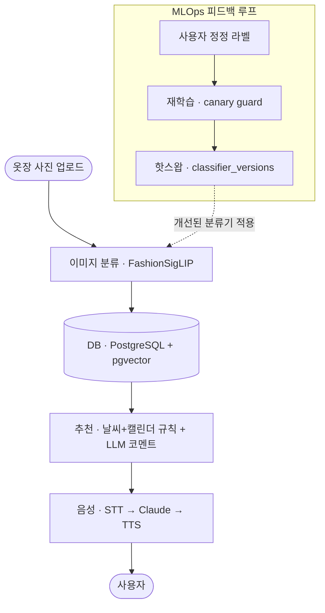

# CW (My Mini Co-di) — 결과 & 증명

> AI 개인 스타일리스트. 옷장 사진을 올리면 패션 비전 모델이 종류·보온도를 분류하고, 기상청 날씨 + 구글 캘린더로 코디를 추천하며, AI 수석 디자이너가 **음성으로** 조언합니다. 핵심은 사용자 정정이 모델을 개선하는 **production급 MLOps 피드백 루프**.

| 항목 | 값 |
|---|---|
| 코드 | Python **6,680 LOC** / 26 파일 |
| 스택 | FastAPI · PostgreSQL+pgvector · Marqo-FashionSigLIP · Claude · Google TTS |
| 라우트 | **31개** (REST + WebSocket 음성) |
| DB | 7 테이블 (`classifier_versions` · `training_runs` 포함) |
| 내 기여 (HJ) | **인증 · DB · 음성 파이프라인 · UI 통합** (4인 팀) |

---

## 1. 아키텍처


<details>
<summary>다이어그램 소스 (Mermaid)</summary>



</details>

---

## 2. 하이라이트 (코드 근거)

- **production급 MLOps 골격** — `db.py` + `training/`: `predicted_*`/`corrected_*` 라벨 분리 → parquet 스냅샷(`build_dataset.py`) → 학습(logreg/mlp/lightgbm, `train.py`) → **canary guard**(이전 active 대비 정확도 하락 시 활성화 보류) → `classifier_versions.is_active` 핫스왑. 주니어 포트폴리오에 드문 "모델을 운영·개선하는 사고".
- **이미지 분류 실동작** — `model.py`: Marqo-FashionSigLIP feature extractor + DB의 active 경량 분류기 우선, 없으면 59라벨 softmax. 배치 1-forward, 768d 임베딩 pgvector 저장.
- **실시간 음성 상태머신**(내 핵심 기여) — `voice/router.py`: WebSocket + asyncio, barge-in 시 중단 위치 저장 → "코디 이어읽기" 자동 재개. 복잡한 비동기 제어.
- **Flask→FastAPI 마이그레이션 + 호환 셰임** — `app.py`의 `render()`가 `url_for`/`flash`/`current_user` 재구현. 프레임워크 이해 깊이.
- **견고한 외부 연동** — KMA 날씨 다단 폴백, Cloudinary 의사 트랜잭션(업로드 실패 시 DB 미저장), LLM JSON 4단 파싱 폴백.

---

## 3. 실행 증거 (캡처 — 여기에 첨부)

- 📊 **분류 성능 before/after** — zero-shot vs 정정데이터 학습 분류기의 혼동행렬·per-class F1·top-k (`make_eval.py`/`training/evaluate.py` 결과)
- 🎬 **데모 GIF** — 사진 업로드 → 추천 → 음성 조언(barge-in) 30~60초
- 📸 **대시보드 화면** — 추천 카드 + AI 코멘트

---

## 4. 한계 (정직 기록 / 개선 백로그)

- 🔴 **아이템 단위 피드백 루프 단선** — `save_recommendation_items()`가 정의만 되고 미호출 → `recommendation_items` 공백, `/feedback/item`·`/api/wardrobe/similar` 고아 엔드포인트. (의류 분류기 재학습은 `/wardrobe/correct` 경로로 별개 동작) → 호출 연결 + re-ranker 학습 예정.
- 🟡 **추천 = 규칙 필터 + LLM** — 스코어링/랭킹 모델 아님 → 설명가능 스코어링으로 격상 예정.
- 🟡 **보안** — CSRF 미적용, 세션쿠키 SameSite/Secure 미설정, `marked.parse→innerHTML` 무살균(XSS) → 보강 예정.
- 🟡 **데드코드/문서 불일치** — `recommend.py`·`weather.py`(레거시), README의 스택 표기(Gemini/YOLO vs 실제 Claude/FashionSigLIP), 모델명(opus vs sonnet) → 정리 예정. requirements 버전 핀.

> 팀 프로젝트입니다. 면접에선 **내 기여(인증·DB·음성·통합)**와 팀 기여를 명확히 구분합니다.

---

## 5. 재현

```bash
cp .env.example .env   # 키 채우기
docker compose up -d   # web + postgres(pgvector)
```
모델 체크포인트·데이터셋·평가결과(`*.pt`·parquet·`eval_result.json`)는 `.gitignore`로 제외(런타임/로컬 보관).
